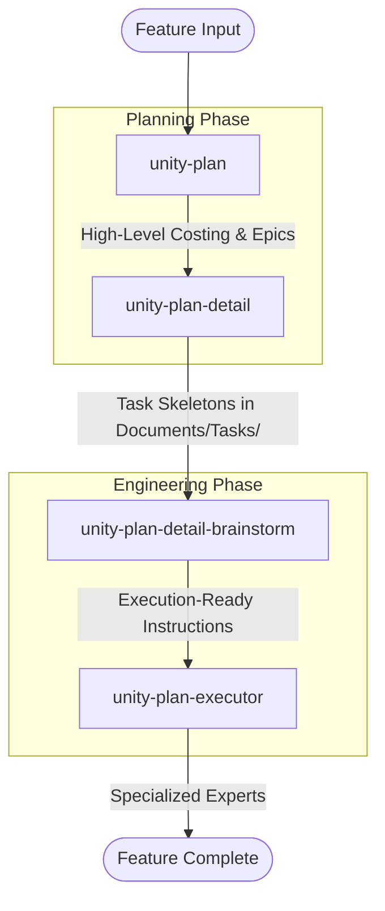

# Unity Agent Configuration

This directory contains configuration files for AI agents (like Google Antigravity) to work effectively with this Unity project.

## 📁 Directory Structure

```
.agent/
├── README.md           # This file
├── agents/             # Agent definitions (orchestrators, core, specialized)
├── docs/               # Documentation on creating agents and best practices
├── rules/              # Project-wide rules agents must follow
├── skills/             # Specialized capabilities for agents
└── workflows/          # Step-by-step procedures for common tasks
```

---

## ⚙️ Installation

To set up the agent configuration in your Unity project, run the following command from your project root:

```bash
git clone https://github.com/cuozg/oh-my-unity.git ./.agent
```

### 🚀 Implementation Pipeline

This project follows a structured engineering pipeline to move from high-level ideas to verified, code-complete features.



#### Pipeline Stages:

1.  **`unity-plan`**: Analyzes the input specification to produce a high-level roadmap, epics, and costing estimates.
2.  **`unity-plan-detail`**: Decomposes epics into individual task skeletons. It generates `.md` files in `Documents/Tasks/` defining the requirements and success criteria for each step.
3.  **`unity-plan-detail-brainstorm`**: The technical deep-dive. It uses `unity-code-investigator` to find exact code locations, brainstorms architectural decisions with the user, and provides specific code changes and test cases.
4.  **`unity-plan-executor`**: The final implementation stage. It reads the refined task instructions and coordinates specialized experts (like `unity-coder` or `flatbuffers`) to apply the changes and verify the "Definition of Done".

---

## 📜 Rules

**Location**: `.agent/rules/`

Rules are **always-on** constraints that the agent must follow during every interaction. They define coding standards, asset conventions, and behavioral expectations.

### Current Rules

| File                            | Description                                                           |
| ------------------------------- | --------------------------------------------------------------------- |
| `agent-behavior.md`           | How the agent should interact: safety, proactivity, tool mastery.     |
| `unity-csharp-conventions.md` | C# naming, architecture (SOLID, ScriptableObjects), and performance.  |
| `unity-asset-rules.md`        | Folder structure, asset naming, and optimization for textures/models. |

### How to Add a Rule

1. Create a new `.md` file in `.agent/rules/`.
2. Add YAML frontmatter:
   ```yaml
   ---
   trigger: always_on
   glob: Human Readable Title
   description: What this rule enforces.
   ---
   ```
3. Write the rule content in Markdown.

---

## 🛠️ Skills

**Location**: `.agent/skills/`

Skills are **specialized capabilities** that extend the agent's expertise. Each skill lives in its own folder and contains a `SKILL.md` file with instructions, plus optional helper scripts.

### Current Skills

| Skill                            | Description                                                        |
| -------------------------------- | ------------------------------------------------------------------ |
| `unity/`                       | The master Unity technical lead and orchestrator.                  |
| `flatbuffers/`                 | Specialist in FlatBuffers schema and data management.              |
| `mermaid/`                     | Specialist in visual diagrams and architectural mapping (Mermaid). |
| `unity-mcp-basics/`            | Mastery of the `unityMCP` toolset for Unity Editor automation.   |
| `unity-editor-developer/`      | Specialist in custom Editor tools, windows, and automation.       |
| `unity-coder/`                 | Specialist in implementing C# logic and architectural patterns.    |
| `unity-tech-artist/`           | Bridge between art and code (Shaders, Pipeline Automation).        |
| `unity-mobile-developer/`      | Specialist in iOS/Android deployment, interop, and optimization.   |
| `unity-debugger/`              | Systematic diagnosis and resolution of Unity technical errors.     |
| `unity-performance-optimizer/` | Identification and resolution of performance bottlenecks.          |
| `unity-pr-reviewer/`           | Automated GitHub PR reviews with commit-ready suggestions.         |
| `unity-documentation/`         | Expert in crafting technical documentation for projects and APIs.  |
| `unity-plan/`                  | Requirement decomposition into structured implementation plans.    |
| `unity-plan-detail/`           | Decomposes plans into detailed tasks with code and test cases.    |
| `unity-plan-detail-brainstorm/`| Deep-dive investigation and refined coding instructions for tasks. |
| `unity-plan-executor/`         | Executes detailed technical tasks based on .md files in Documents/Tasks/. |
| `unity-code-investigator/`     | Deep-dive analysis of C# logic and execution flow tracing.         |
| `unity-tdd-writer/`            | Formal Technical Design Document (TDD) generation (WWE 2025).      |
| `unity-test/`                  | Automated testing using the Unity Test Framework (Edit/Play Mode). |
| `unity-web-developer/`         | Specialist in WebGL deployment, interop, and browser optimization.  |
| `skill-creator/`               | Meta-skill for creating and improving other project skills.        |

### Skill Folder Structure

```
skills/<skill-name>/
├── SKILL.md           # Main instructions with trigger metadata
├── scripts/           # (Optional) Automated execution logic
├── references/        # (Optional) Domain knowledge and patterns
└── assets/            # (Optional) Templates and static resources
```

### How to Create a Skill

1. Create a folder: `.agent/skills/<your-skill-name>/`.
2. Add a `SKILL.md` file with:
   ```yaml
   ---
   name: your-skill-name
   description: Detailed triggers of when to use this skill.
   ---
   # Your Skill Name

   Procedural instructions for the agent...
   ```
3. Add supporting resources in `scripts/`, `references/`, or `assets/`.

---

## 🔄 Workflows

**Location**: `.agent/workflows/`

Workflows are **step-by-step procedures** for complex, repetitive tasks. They can be invoked with a slash command (e.g., `/fix-errors`).

### Current Workflows

| Command                         | Description                                                                       |
| ------------------------------- | --------------------------------------------------------------------------------- |
| `/unity-fix-errors`           | Diagnose and fix Unity compiler or runtime errors.                                |
| `/unity-documentation`        | Create and maintain technical project documentation.                              |
| `/unity-optimize-performance` | Identify and resolve performance bottlenecks.                                     |
| `/unity-implement-logic`      | Implement or refactor Unity C# logic and gameplay systems.                        |
| `/unity-mobile-deploy`        | Optimize, build, and deploy the project to iOS and Android.                       |
| `/unity-review-pr`            | Conduct a full code review on a GitHub Pull Request.                              |
| `/unity-plan`                 | Investigate requirements and produce a detailed implementation plan with costing. |
| `/unity-investigate-code`     | Deep-dive into complex logic, execution flows, and feature implementations.       |
| `/unity-write-tdd`            | Generate a Technical Design Document (TDD) based on the WWE 2025 template.        |
| `/unity-test`                 | Create and run automated tests using the Unity Test Framework.                    |
| `/unity-web-deploy`           | Optimize, build, and deploy the project to the WebGL platform.                    |

### How to Create a Workflow

1. Create a new `.md` file: `.agent/workflows/<your-workflow>.md`.
2. Add YAML frontmatter with a description:
   ```yaml
   ---
   description: What this workflow does.
   ---
   ```
3. Write numbered steps. Use `// turbo` above a step to auto-run it, or `// turbo-all` anywhere to auto-run all steps.

---

## 🤖 Agents

**Location**: `.agent/agents/`

Agents are specialized AI personas designed for specific roles in game development. They are organized into categories:

- **`orchestrators/`**: High-level coordinators (e.g., `unity-tech-lead`).
- **`core/`**: Cross-cutting concerns (Performance, Build, QA, Code Review).
- **`specialized/`**: Domain experts (Graphics, Networking, Animation).
- **`platforms/`**: Platform-specific agents (Mobile, VR).
- **`universal/`**: Non-Unity roles (Game Design, Audio).

See `.agent/docs/creating-agents.md` for how to create a new agent.

---

## 🚀 Quick Start

1. **Ask for a review**: *"Review PR #25141 for performance issues."* (Agent will use `/unity-review-pr`).
2. **Fix errors**: *"/unity-fix-errors"*
3. **Plan a feature**: *"/unity-plan Add a player health bar to the UI"* (Agent will use rules and skills automatically).

For more details, see the files in `.agent/docs/`.
