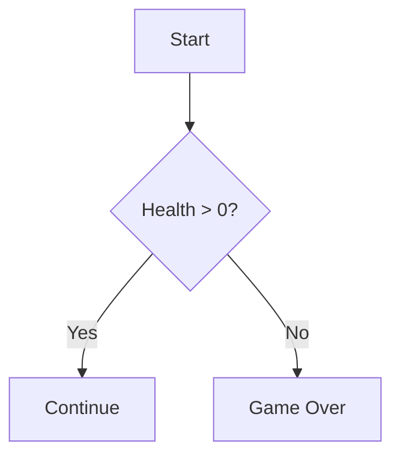
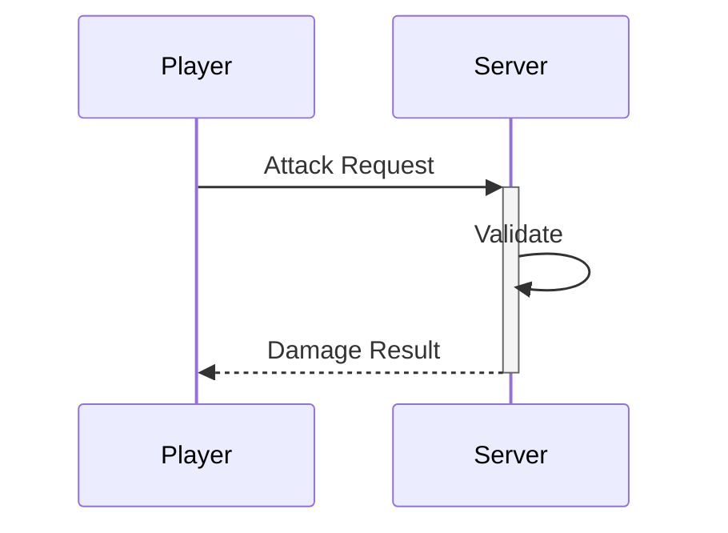
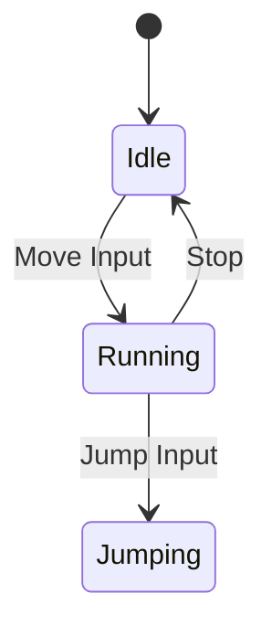
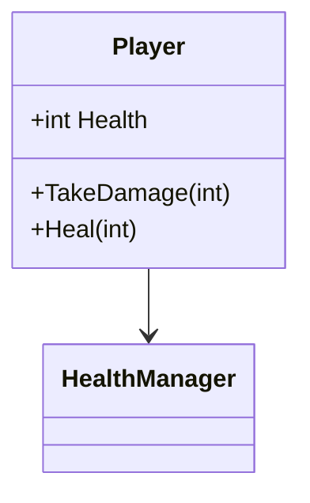

# Mermaid Diagrams

Visualize systems with Mermaid.js syntax.

## Quick Examples

### Flowchart (Logic/Decision)


### Sequence (Communication)


### State (Transitions)


### Class (Structure)


## Workflow

1. **Analyze**: Identify entities and relationships, pick chart type
2. **Author**: Use patterns from [MERMAID_PATTERNS.md](references/MERMAID_PATTERNS.md)
3. **Validate**: Check syntax, verify accuracy
4. **Embed**: Wrap in ` ```mermaid ` code blocks

## Principles

- **Keep Simple**: Multiple small diagrams > one giant spaghetti
- **Top-Down**: Prefer `TD` or `LR` direction
- **Highlight Critical**: Use `classDef` for special entities (Singletons, external APIs)
- **Consistent Aliases**: Same participant names across all docs
