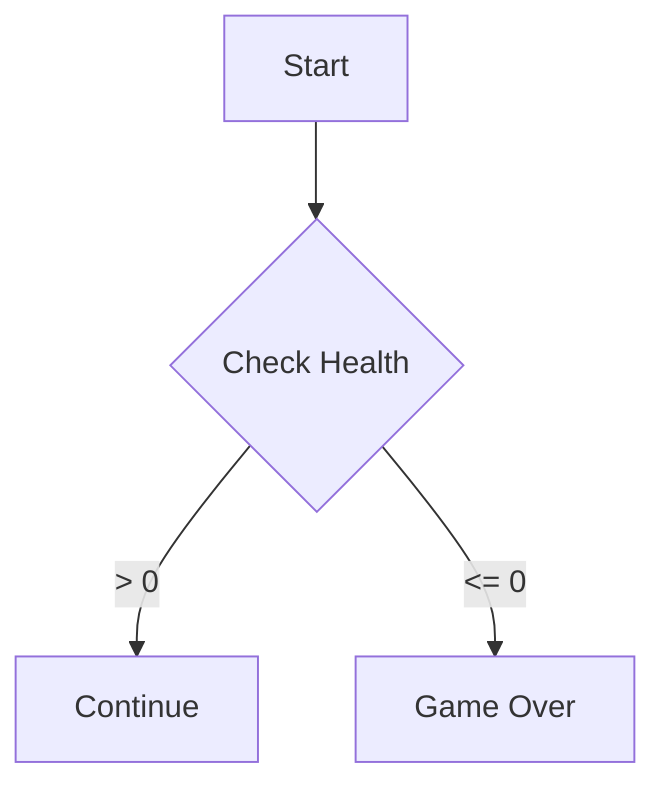
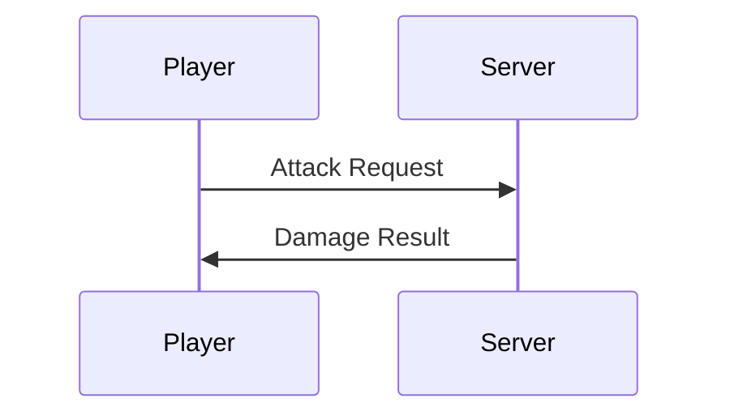

# Mermaid Diagram Specialist

Visualize complex systems using Mermaid.js syntax.

## Diagram Types

| Type | Use Case |
|------|----------|
| Flowchart | Logic flows, decision trees |
| Sequence | Component communication, API calls |
| Class | Data relationships, inheritance |
| State | UI states, game states |

## Workflow

1. **Analyze**: Identify entities and relationships
2. **Choose Type**: Match to diagram type above
3. **Author**: Use patterns from [MERMAID_PATTERNS.md](references/MERMAID_PATTERNS.md)
4. **Validate**: Check syntax, ensure accuracy
5. **Embed**: Wrap in ` ```mermaid ` code blocks

## Quick Examples





## Best Practices

- **Keep Simple**: Multiple small diagrams > one giant chart
- **Top-Down Flow**: Prefer `TD` or `LR` direction
- **Semantic Colors**: Highlight critical paths with `style`/`classDef`
- **Consistent Aliases**: Same participant names across project docs
