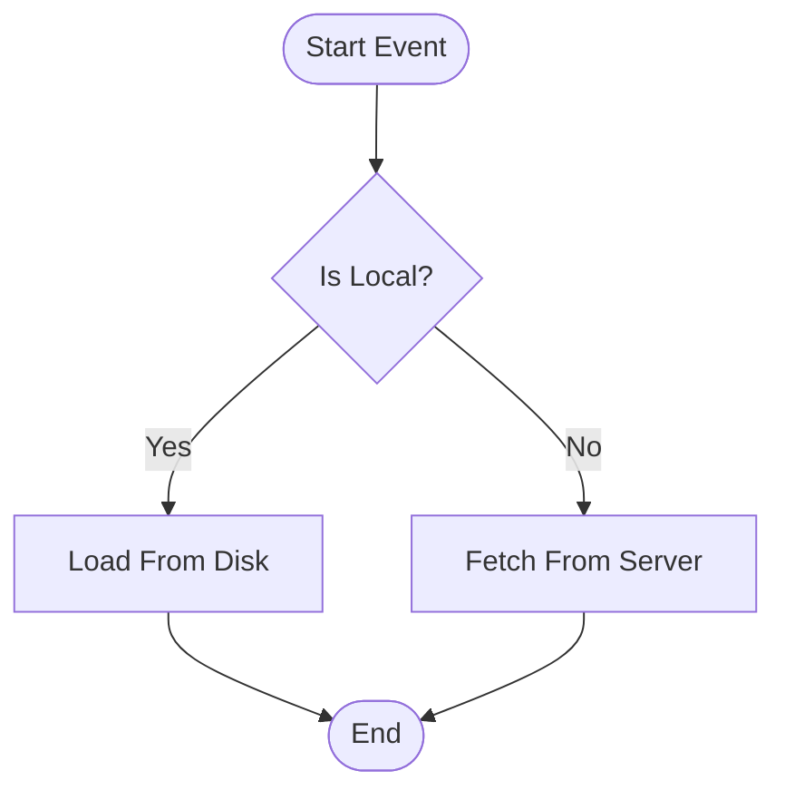
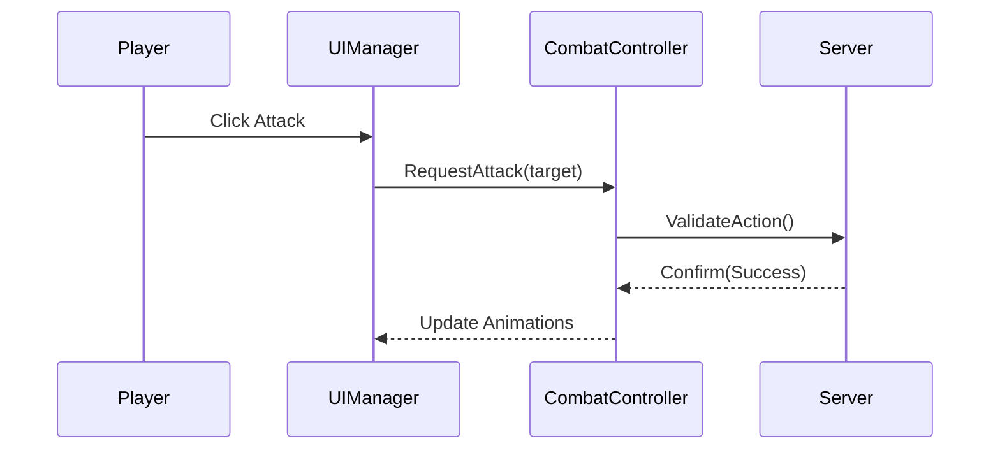
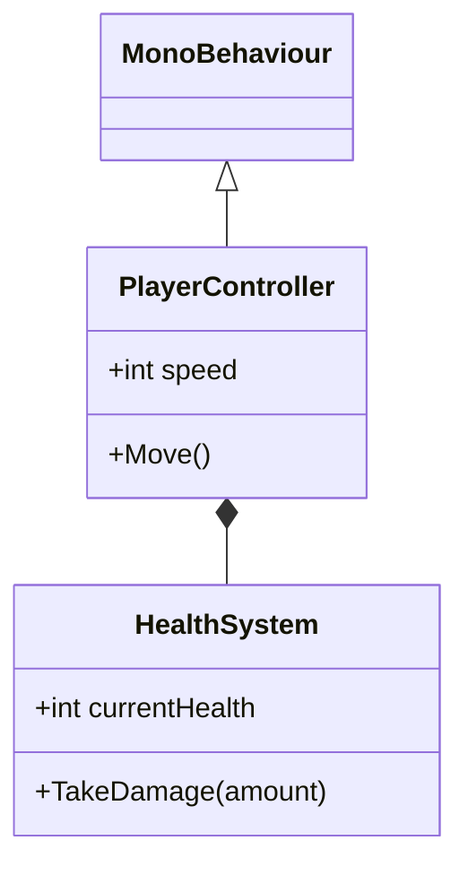
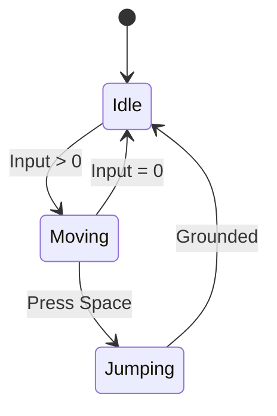

# Mermaid Chart Patterns

Common Mermaid syntax patterns for documenting Unity project architectures and logic flows.

## 1. Flowcharts (Process & Logic)

Use for gameplay loops, decision trees, or state transitions.

## 2. Sequence Diagrams (Inter-Component Communication)

Use for explaining how systems interact over time (e.g., UI -> Controller -> Manager -> Server).

## 3. Class Diagrams (Data Structures)

Use for documenting C# class hierarchies or FlatBuffer table relationships.

## 4. State Diagrams

Use for documenting FSM (Finite State Machines) or Animators.

