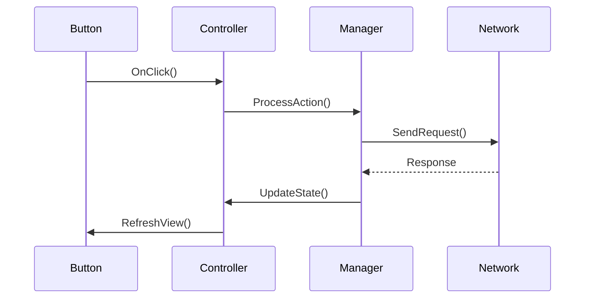

# Unity Code Investigator

Trace and explain C# logic execution in Unity projects.

## Workflow

1. **Scope**: Identify target class/method/feature, get entry points if complex
2. **Discover**: Run `scripts/trace_logic.sh [Target]`, use `find_gameobjects` for prefab bindings
3. **Trace**: Follow from entry (`Update`, `OnClick`, etc.) through call stack
4. **Side Effects**: Check Singletons, static managers, events, network calls
5. **Report**: Save to `Documents/Investigations/INVESTIGATION_[FeatureName].md`

## Output: Use Mermaid for Complex Flows

For diagram syntax, load the `mermaid` skill.

## Key Analysis Points

| Check | Why |
|:------|:----|
| Unity lifecycle order | Awake → OnEnable → Start → Update |
| Async sequences | Awaitable/Coroutine state management |
| Global state changes | Singletons, static managers |
| Event dispatch | Who listens? What side effects? |

## Principles

- **Breadth-First**: Survey involved files before deep-diving
- **Unity Context**: Physics, Input, UI system interactions
- **Recover Intent**: Explain "why" not just "what"
- **Flag Risks**: Technical debt, threading issues, optimization opportunities
