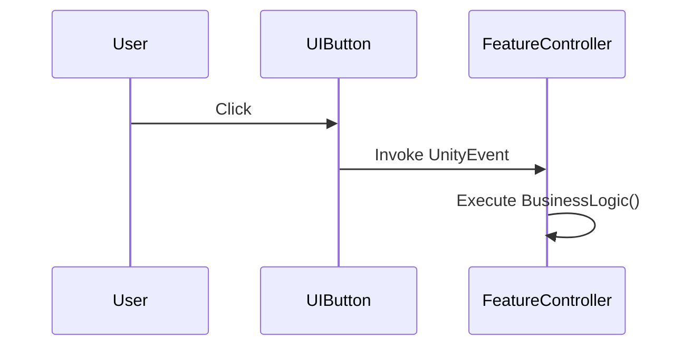

# Investigation Report: [Feature/Logic Name]

## 1. Overview
Summary of the investigated function or feature and its purpose in the game.

## 2. Key Components
| Class / Script | Responsibility | Role in Feature |
|:---|:---|:---|
| `ClassName.cs` | Brief description | e.g., Controller, Data Provider |

## 3. Execution Flow
Describe the sequence of actions.

1.  **Trigger**: [What starts the logic? e.g., User click on 'Start Game']
2.  **Processing**: [Key methods called in order]
3.  **Outcome**: [Result of the logic, e.g., Scene change, state update]

## 4. Logic Deep-Dive
Explanation of complex parts of the code.

### [MethodName]
- **Inputs**: [Parameters]
- **Logic**: [Step-by-step breakdown]
- **Outputs**: [Return values or state changes]

## 5. Dependencies & Side Effects
- **Required Systems**: [e.g., InventoryManager, GameDataManager]
- **State Changes**: [Variables or Singletons modified]
- **External Notifications**: [Events fired, UI updated]

## 6. Findings & Insights
- Potential edge cases discovered.
- Performance considerations.
- Suggestions for improvement or refactoring.
