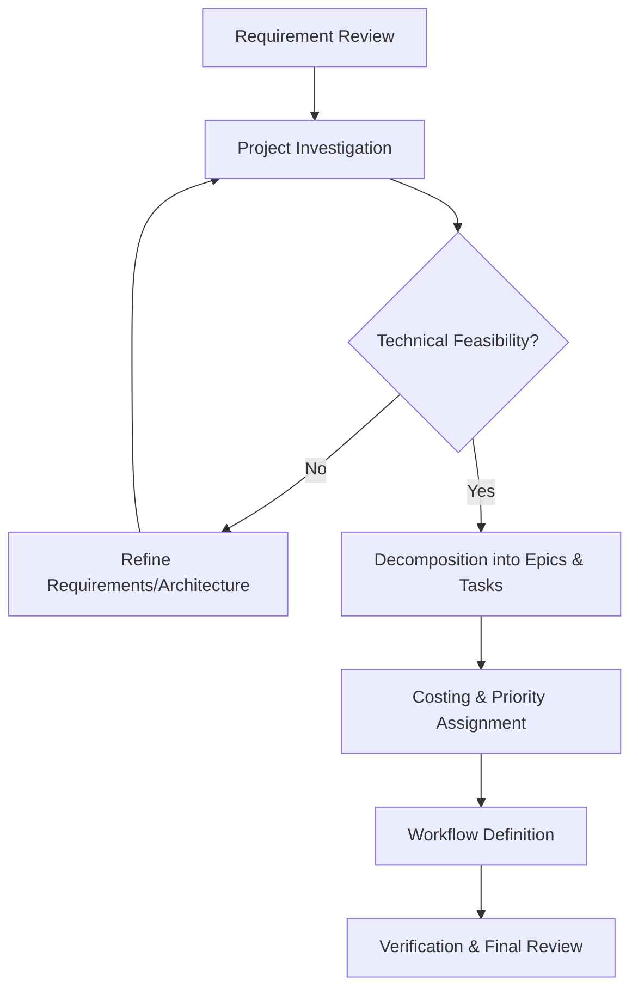

# Unity Planning Skill

This skill allows the agent to transform requirements or specifications into a structured, actionable project plan within a Unity context. It focuses on technical feasibility, project alignment, and clear task decomposition.

## Core Capabilities

### 1. Project Base Investigation
- **Context Discovery**: Analyze existing scripts, prefabs, and systems related to the new requirement.
- **Dependency Mapping**: Identify which existing systems will be impacted or added.
- **Gap Analysis**: Determine what is missing from the current codebase to satisfy the new requirement.

### 2. Epic & Task Decomposition
- **Epics**: Large bodies of work that can be broken down into smaller tasks (e.g., "Combat System Refactor", "Inventory UI Implementation").
- **Tasks**: Granular, actionable items with specific types:
    - **Logic**: C# core functionality, state machines, controllers.
    - **UI**: Canvas setup, panels, buttons, view-controller binding.
    - **Data**: ScriptableObjects, JSON schemas, database models.
    - **API**: Network endpoints, internal service interfaces, events.
    - **Asset**: Prefabs, Materials, VFX, Animations.
    - **Test**: Unit tests, integration tests, manual QA steps.

### 3. High-Level Costing
- Provide estimated effort in T-shirt sizes (S, M, L, XL) or developer hours/days.
- Identify risk factors and technical debt implications.

### 4. Implementation Workflow
- Define a step-by-step technical roadmap, including "Build, Test, Integrate" cycles.

## Documentation Template

Use the `IMPLEMENTATION_PLAN.md` template in `resources/templates/` for all planning outputs. The task list MUST follow the specified table format.

## Planning Workflow

## Task Table Format
When listing tasks, strictly use the following columns:
| Number | Epic | Task | Description | Type | Cost | Note |
|:---:|:---|:---|:---|:---:|:---:|:---|
| 1.1 | Epic Name | Task Name | Detailed explanation | Logic | M | Any technical risks |

## Best Practices

- **Atomic Tasks**: Each task should ideally be achievable in a single turn/session.
- **Definition of Done**: Specify how each task or Epic is verified (e.g., "Validated in Test Scene").
- **Costing Honesty**: Be realistic about complexity, especially concerning legacy code.
- **Safety First**: Propose safe migration paths for breaking changes.
